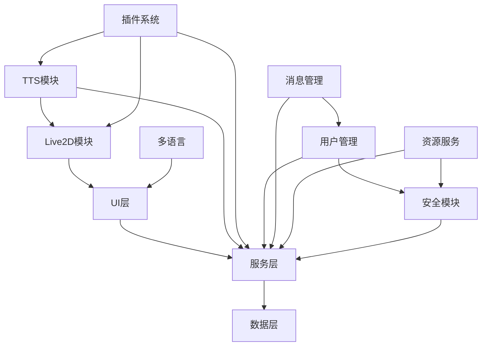

# SillyTavern-Arvin 模块分析文档

## 目录
1. [垂直层级拆解](#垂直层级拆解)
2. [水平模块分析](#水平模块分析)
3. [独立高内聚模块详解](#独立高内聚模块详解)
4. [模块间依赖关系](#模块间依赖关系)
5. [魔改指南](#魔改指南)

---

## 垂直层级拆解

### 1. UI 层（前端展示与交互）

#### 1.1 页面入口模块
- **文件位置**: `public/index.html`, `public/login.html`
- **核心功能**: 应用入口、登录认证
- **关键特性**:
  - 响应式设计
  - 登录状态管理
  - 路由分发

#### 1.2 样式与主题模块
- **文件位置**: `public/css/`, `default/content/themes/`
- **核心功能**: 界面样式、主题切换
- **关键文件**:
  - `public/css/st-tailwind.css` - 主样式框架
  - `public/css/animations.css` - 动画效果
  - `default/content/themes/*.json` - 主题配置

#### 1.3 脚本与交互模块
- **文件位置**: `public/script.js`, `public/lib/`, `public/scripts/`
- **核心功能**: 前端逻辑、用户交互
- **关键组件**:
  - 消息处理
  - 角色管理
  - 设置面板
  - 扩展功能

#### 1.4 Live2D 展示模块
- **文件位置**: `public/img/`, `default/content/backgrounds/`
- **核心功能**: 角色动画、背景展示
- **资源类型**:
  - 角色头像
  - 背景图片
  - 表情包

#### 1.5 多语言模块
- **文件位置**: `public/locales/`
- **核心功能**: 界面国际化
- **支持语言**: 中文、英文、日文等

### 2. 服务层（前端服务与后端接口）

#### 2.1 主服务模块
- **文件位置**: `server.js`
- **核心功能**: 应用启动、服务配置
- **关键特性**:
  - Express 服务器
  - 中间件配置
  - 路由注册

#### 2.2 API 接口模块
- **文件位置**: `src/endpoints/`
- **核心功能**: 后端接口实现
- **主要接口**:
  - 用户管理
  - 消息处理
  - 角色管理
  - TTS 服务

#### 2.3 中间件模块
- **文件位置**: `src/middleware/`
- **核心功能**: 请求处理、安全控制
- **中间件类型**:
  - 身份验证
  - 访问日志
  - 缓存控制
  - 错误处理

#### 2.4 插件加载模块
- **文件位置**: `src/plugin-loader.js`
- **核心功能**: 插件系统管理
- **特性**:
  - 动态加载
  - 依赖管理
  - 生命周期控制

#### 2.5 事件系统模块
- **文件位置**: `src/server-events.js`
- **核心功能**: 实时事件推送
- **事件类型**:
  - 消息更新
  - 状态变化
  - 系统通知

### 3. 数据与配置层

#### 3.1 配置管理模块
- **文件位置**: `default/config.yaml`, `default/content/settings.json`
- **核心功能**: 系统配置管理
- **配置类型**:
  - 全局设置
  - 用户偏好
  - 功能开关

#### 3.2 数据存储模块
- **文件位置**: `default/content/`
- **核心功能**: 数据持久化
- **数据类型**:
  - 角色信息
  - 对话历史
  - 用户设置

#### 3.3 预设管理模块
- **文件位置**: `default/content/presets/`
- **核心功能**: 预设模板管理
- **预设类型**:
  - 上下文模板
  - 指令模板
  - 系统提示

---

## 水平模块分析

### UI 层水平模块

#### 主题与皮肤模块
- **职责**: 界面外观管理
- **关键文件**: `public/css/`, `default/content/themes/`
- **功能点**:
  - 主题切换
  - 颜色定制
  - 布局调整

#### 角色与Live2D模块
- **职责**: 角色展示与动画
- **关键文件**: `public/img/`, `public/extensions/live2d/`
- **功能点**:
  - 角色渲染
  - 动画控制
  - 表情管理

#### 消息展示与输入模块
- **职责**: 对话界面管理
- **关键文件**: `public/scripts/messages.js`
- **功能点**:
  - 消息显示
  - 输入处理
  - 历史记录

#### 设置面板模块
- **职责**: 用户设置管理
- **关键文件**: `public/scripts/settings.js`
- **功能点**:
  - 参数配置
  - 功能开关
  - 个性化设置

#### 扩展面板模块
- **职责**: 扩展功能展示
- **关键文件**: `public/extensions/`
- **功能点**:
  - TTS 控制
  - 记忆管理
  - 画廊功能

### 服务层水平模块

#### 用户与会话管理模块
- **职责**: 用户认证与会话控制
- **关键文件**: `src/users.js`, `src/endpoints/users.js`
- **功能点**:
  - 用户登录
  - 权限控制
  - 会话维护

#### 消息处理与分发模块
- **职责**: 消息流转处理
- **关键文件**: `src/endpoints/messages.js`
- **功能点**:
  - 消息接收
  - 内容处理
  - 响应生成

#### 插件与扩展管理模块
- **职责**: 扩展功能管理
- **关键文件**: `src/plugin-loader.js`
- **功能点**:
  - 插件加载
  - 依赖解析
  - 生命周期管理

#### 角色与记忆管理模块
- **职责**: 角色信息与记忆存储
- **关键文件**: `src/endpoints/characters.js`
- **功能点**:
  - 角色创建
  - 记忆存储
  - 信息检索

#### TTS 语音合成模块
- **职责**: 文本转语音服务
- **关键文件**: `src/endpoints/tts.js`, `GPT-SoVITS-beta/`
- **功能点**:
  - 语音合成
  - 角色语音
  - 队列管理

#### 资源与静态文件服务模块
- **职责**: 静态资源分发
- **关键文件**: `src/endpoints/assets.js`
- **功能点**:
  - 文件服务
  - 缓存控制
  - 权限验证

#### 鉴权与安全模块
- **职责**: 安全控制与访问管理
- **关键文件**: `src/middleware/basicAuth.js`
- **功能点**:
  - 身份验证
  - 访问控制
  - 安全防护

#### 日志与监控模块
- **职责**: 系统监控与日志记录
- **关键文件**: `src/middleware/accessLogWriter.js`
- **功能点**:
  - 访问日志
  - 错误记录
  - 性能监控

---

## 独立高内聚模块详解

### 1. TTS（文本转语音）模块

#### 模块概述
TTS 模块是 SillyTavern-Arvin 的核心功能之一，负责将文本转换为语音，支持多种 TTS 服务提供商。

#### 核心组件
- **前端组件**: `public/extensions/tts/`
  - TTS 控制面板
  - 语音设置界面
  - 实时状态显示
- **后端服务**: `src/endpoints/tts.js`
  - TTS API 接口
  - 语音队列管理
  - 服务提供商集成
- **外部服务**: `GPT-SoVITS-beta/`
  - FastAPI 服务端
  - 语音合成引擎
  - 模型管理

#### 关键功能
1. **语音合成**
   - 文本预处理
   - 语音生成
   - 音频输出
2. **角色语音**
   - 角色语音分配
   - 语音特征定制
   - 多角色支持
3. **队列管理**
   - 消息排队
   - 优先级控制
   - 并发处理

#### 技术特点
- 支持多种 TTS 服务
- 实时语音合成
- 角色个性化语音
- 队列优化处理

### 2. Live2D 角色模块

#### 模块概述
Live2D 模块负责角色的动态展示，包括动画、表情和语音资源管理。

#### 核心组件
- **渲染引擎**: `public/extensions/live2d/`
  - Live2D 核心库
  - 动画控制器
  - 表情管理器
- **资源管理**: `public/img/`, `default/content/`
  - 角色模型
  - 表情资源
  - 背景图片

#### 关键功能
1. **角色动画**
   - 基础动画
   - 表情变化
   - 动作响应
2. **资源管理**
   - 模型加载
   - 资源缓存
   - 动态更新
3. **交互响应**
   - 用户交互
   - 事件触发
   - 状态同步

#### 技术特点
- 实时渲染
- 资源优化
- 跨平台兼容
- 扩展性强

### 3. 插件与扩展系统模块

#### 模块概述
插件系统是 SillyTavern-Arvin 的扩展机制，支持功能模块的动态加载和管理。

#### 核心组件
- **加载器**: `src/plugin-loader.js`
  - 插件发现
  - 依赖解析
  - 生命周期管理
- **扩展目录**: `public/extensions/`
  - 功能扩展
  - UI 组件
  - 工具模块

#### 关键功能
1. **插件管理**
   - 动态加载
   - 版本控制
   - 依赖管理
2. **API 暴露**
   - 接口定义
   - 权限控制
   - 文档生成
3. **生命周期**
   - 初始化
   - 运行管理
   - 清理回收

#### 技术特点
- 模块化设计
- 热插拔支持
- 版本兼容
- 安全隔离

### 4. 多语言与本地化模块

#### 模块概述
多语言模块提供界面国际化支持，支持多种语言的动态切换。

#### 核心组件
- **语言包**: `public/locales/`
  - 翻译文件
  - 语言配置
  - 文化适配
- **切换器**: `public/scripts/locale.js`
  - 语言检测
  - 动态切换
  - 缓存管理

#### 关键功能
1. **语言支持**
   - 多语言识别
   - 自动切换
   - 手动选择
2. **内容翻译**
   - 界面文本
   - 错误信息
   - 帮助文档
3. **文化适配**
   - 日期格式
   - 数字格式
   - 方向布局

#### 技术特点
- 完整国际化
- 动态切换
- 文化适配
- 扩展性强

### 5. 用户与会话管理模块

#### 模块概述
用户管理模块负责用户认证、权限控制和会话状态管理。

#### 核心组件
- **用户服务**: `src/users.js`
  - 用户信息管理
  - 权限控制
  - 会话维护
- **认证接口**: `src/endpoints/users.js`
  - 登录接口
  - 注册接口
  - 权限验证

#### 关键功能
1. **用户认证**
   - 登录验证
   - 密码管理
   - 会话创建
2. **权限控制**
   - 角色管理
   - 访问控制
   - 资源保护
3. **会话管理**
   - 状态维护
   - 超时处理
   - 安全清理

#### 技术特点
- 安全认证
- 权限分级
- 会话安全
- 可扩展性

### 6. 消息与上下文管理模块

#### 模块概述
消息管理模块负责对话消息的处理、存储和上下文维护。

#### 核心组件
- **消息处理**: `src/endpoints/messages.js`
  - 消息接收
  - 内容处理
  - 响应生成
- **上下文管理**: `public/scripts/messages.js`
  - 对话历史
  - 上下文维护
  - 记忆管理

#### 关键功能
1. **消息处理**
   - 接收解析
   - 内容验证
   - 响应生成
2. **上下文维护**
   - 历史记录
   - 状态同步
   - 记忆存储
3. **数据管理**
   - 持久化存储
   - 缓存优化
   - 清理策略

#### 技术特点
- 实时处理
- 状态同步
- 数据持久化
- 性能优化

### 7. 资源与静态文件服务模块

#### 模块概述
资源服务模块负责静态文件的存储、分发和缓存管理。

#### 核心组件
- **文件服务**: `src/endpoints/assets.js`
  - 静态文件服务
  - 缓存控制
  - 权限验证
- **资源管理**: `public/`, `default/content/`
  - 文件存储
  - 目录结构
  - 版本控制

#### 关键功能
1. **文件服务**
   - 静态资源分发
   - 动态内容生成
   - 压缩优化
2. **缓存管理**
   - 浏览器缓存
   - 服务器缓存
   - 版本控制
3. **权限控制**
   - 访问验证
   - 资源保护
   - 安全控制

#### 技术特点
- 高效分发
- 缓存优化
- 安全控制
- 扩展性强

### 8. 安全与鉴权模块

#### 模块概述
安全模块提供身份验证、访问控制和安全防护功能。

#### 核心组件
- **认证中间件**: `src/middleware/basicAuth.js`
  - 身份验证
  - 权限检查
  - 安全防护
- **日志记录**: `src/middleware/accessLogWriter.js`
  - 访问日志
  - 安全审计
  - 异常监控

#### 关键功能
1. **身份验证**
   - 用户认证
   - 会话管理
   - 权限验证
2. **访问控制**
   - 资源保护
   - 操作限制
   - 安全策略
3. **安全监控**
   - 异常检测
   - 日志记录
   - 审计追踪

#### 技术特点
- 多层防护
- 实时监控
- 审计追踪
- 可配置性

---

## 模块间依赖关系

### 依赖关系图

### 关键依赖说明

1. **UI层依赖服务层**
   - 前端通过 API 调用后端服务
   - 实时事件通过 WebSocket 接收
   - 静态资源通过 HTTP 服务获取

2. **服务层依赖数据层**
   - 配置信息从配置文件读取
   - 用户数据从存储系统获取
   - 预设模板从预设目录加载

3. **模块间依赖**
   - TTS 模块依赖消息管理
   - Live2D 模块依赖资源服务
   - 插件系统依赖核心服务
   - 安全模块贯穿所有服务

---

## 魔改指南

### 1. 模块魔改优先级

#### 高优先级（推荐）
- **TTS 模块**: 功能独立，影响面小
- **Live2D 模块**: 展示层，风险较低
- **多语言模块**: 纯前端，易于测试
- **主题模块**: 样式调整，无功能影响

#### 中优先级（谨慎）
- **插件系统**: 影响扩展功能
- **消息管理**: 核心功能，需充分测试
- **资源服务**: 影响文件访问

#### 低优先级（不推荐）
- **用户管理**: 安全相关，风险高
- **安全模块**: 系统安全，需专业评估
- **核心服务**: 影响面大，需全面测试

### 2. 魔改步骤建议

#### 准备阶段
1. **环境备份**
   - 代码版本控制
   - 配置文件备份
   - 数据文件备份

2. **需求分析**
   - 明确修改目标
   - 评估影响范围
   - 制定测试计划

#### 实施阶段
1. **模块隔离**
   - 创建分支开发
   - 独立测试环境
   - 接口兼容性检查

2. **渐进式修改**
   - 小步快跑
   - 及时测试
   - 回滚准备

#### 验证阶段
1. **功能测试**
   - 单元测试
   - 集成测试
   - 用户验收测试

2. **性能测试**
   - 负载测试
   - 压力测试
   - 稳定性测试

### 3. 常见魔改场景

#### 添加新 TTS 服务
1. 在 `public/extensions/tts/` 添加新服务文件
2. 在 `src/endpoints/tts.js` 添加服务接口
3. 更新前端配置界面
4. 测试服务集成

#### 自定义 Live2D 角色
1. 准备角色模型文件
2. 在 `public/img/` 添加资源
3. 配置角色信息
4. 测试动画效果

#### 开发新插件
1. 在 `public/extensions/` 创建插件目录
2. 实现插件逻辑
3. 注册插件接口
4. 测试插件功能

#### 主题定制
1. 在 `default/content/themes/` 创建主题文件
2. 定义样式规则
3. 更新主题配置
4. 测试主题效果

### 4. 注意事项

#### 技术注意事项
- 保持接口兼容性
- 遵循现有代码风格
- 添加适当的错误处理
- 考虑性能影响

#### 安全注意事项
- 验证用户输入
- 控制文件访问权限
- 防止 XSS 攻击
- 保护敏感数据

#### 维护注意事项
- 添加详细注释
- 更新相关文档
- 记录修改历史
- 准备回滚方案

---

## 总结

本模块分析文档提供了 SillyTavern-Arvin 项目的完整模块结构分析，包括：

1. **垂直层级拆解**: 从 UI 层到服务层的清晰层次结构
2. **水平模块分析**: 每层内的功能模块划分
3. **独立模块详解**: 高内聚模块的深入分析
4. **依赖关系**: 模块间的关联和依赖
5. **魔改指南**: 实用的修改建议和注意事项

通过这份文档，开发者可以：
- 快速定位功能模块
- 理解系统架构
- 安全进行功能修改
- 高效进行团队协作

建议在实际开发中结合具体需求，选择合适的模块进行修改，并遵循文档中的最佳实践。 